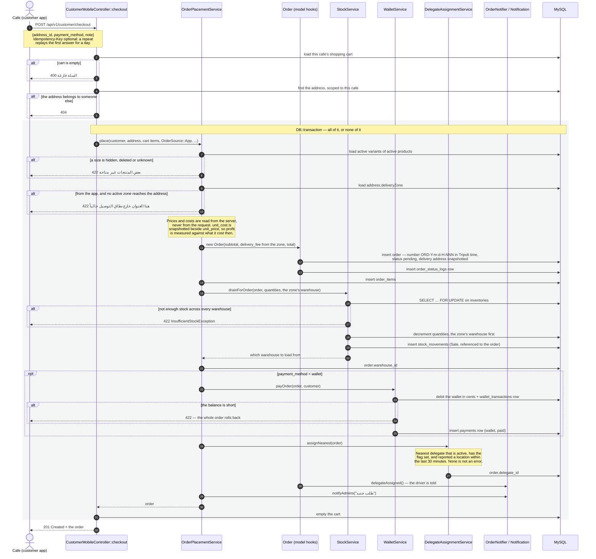
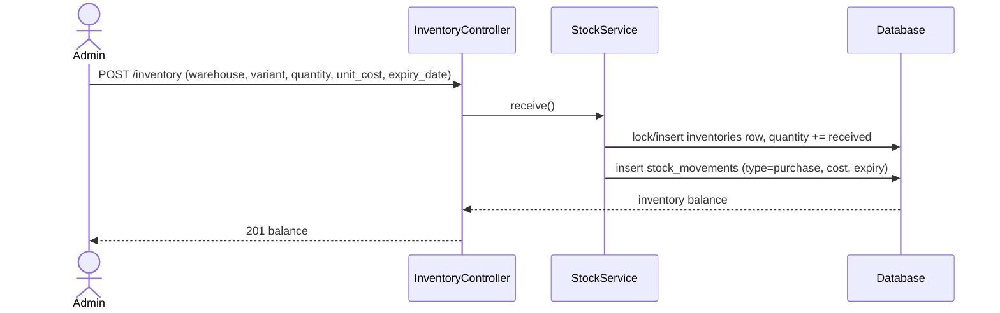
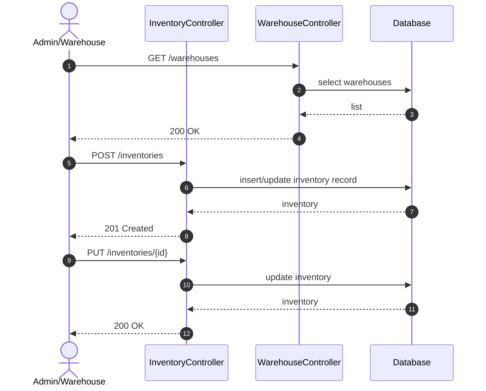

# الساحل لمستلزمات المقاهي — Sequence Diagrams

These Mermaid diagrams describe the main business flows exposed by the API documented at `/api/documentation`.

## 1. Order checkout flow

The cafe's app posts one request, and everything below happens inside it. The
whole thing is one transaction: if any step throws, no order, no stock movement
and no payment survives.

`OrderPlacementService::place()` is the only path that creates an order. The
dashboard (`POST /orders`) and a recurring cart enter the same method with a
different `OrderSource`, which is why the coverage guard below checks the source:
the office may still send an order to an uncovered address on purpose.

What the flow refuses, and why it is refused there rather than in the client:

| Guard | Answer | Lives in |
| --- | --- | --- |
| Payment method other than cash or wallet | 422 | `place()` |
| Empty basket, or a size whose product was hidden | 422 | `place()` |
| Address outside every active zone, from an app | 422 | `place()` |
| Stock short anywhere in the company | 422 | `StockService` |
| Wallet balance short | 422, everything rolls back | `WalletService` |

## 2. Purchase order flow

## 3. Inventory update flow

## Viewing these diagrams

- GitHub, GitLab, and most Markdown viewers render Mermaid natively.
- Swagger UI does **not** render Mermaid out of the box. To keep diagrams alongside the API, paste the Mermaid block into an operation's `@OA\...` `description` field; it will display as a code block in Swagger UI.
