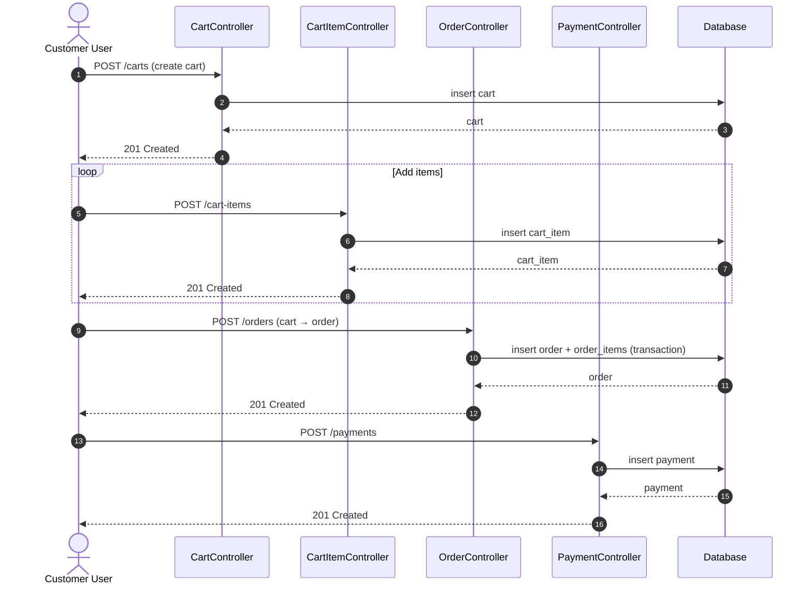
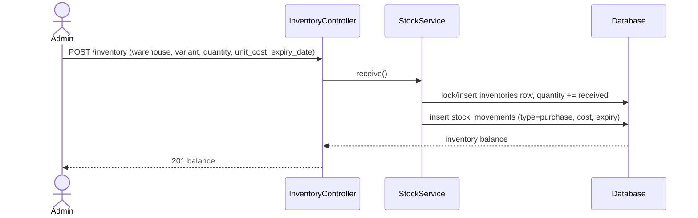
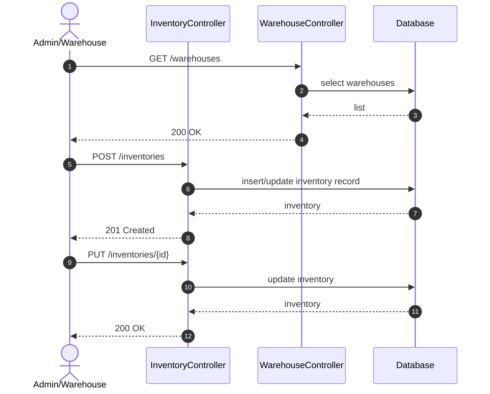

# الساحل لمستلزمات المقاهي — Sequence Diagrams

These Mermaid diagrams describe the main business flows exposed by the API documented at `/api/documentation`.

## 1. Order checkout flow

## 2. Purchase order flow

## 3. Inventory update flow

## Viewing these diagrams

- GitHub, GitLab, and most Markdown viewers render Mermaid natively.
- Swagger UI does **not** render Mermaid out of the box. To keep diagrams alongside the API, paste the Mermaid block into an operation's `@OA\...` `description` field; it will display as a code block in Swagger UI.
